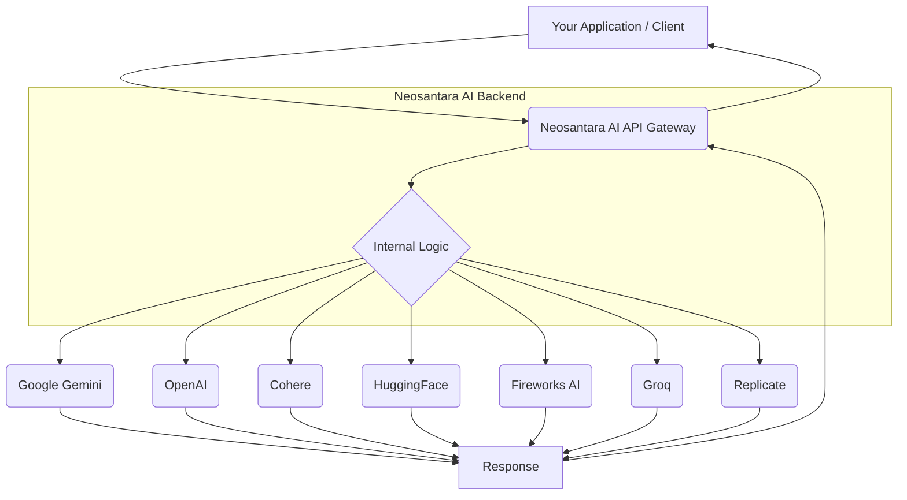

# About

> Welcome to Neosantara AI!

<Note>
  Looking for a step-by-step tutorial to get started in under 5 minutes? Head to our [Quickstart guide](/guides/quickstart) and start coding!
</Note>

## Who are we?

We are a team of AI researchers and developers passionate about helping you build the next generation of AI assistants. **Neosantara AI is independently developed by a dedicated individual**, with a commitment to providing advanced and easily accessible AI technology.

Our mission is to empower individuals and organizations with accurate, unbiased, and factual information through cutting-edge Artificial Intelligence technology.

## What is the Neosantara APIs?

Building AI agents that leverage real-time online information or other advanced capabilities is not a simple task. Neosantara AI serves as a platform optimized for various generative (LLM) and multimodal AI models, aiming to provide efficient, fast, and reliable API access.

Neosantara AI takes on the burden of integrating, optimizing, and managing diverse AI models from various providers, allowing you to focus on developing your core applications. All in a single API call!

<Note>
  While Neosantara AI provides access to various AI models from different providers (such as Google Gemini, OpenAI, Cohere, and others), please note that **Neosantara AI is an independent product and is not directly affiliated with the providers of these models**. We serve as a gateway to help you interact with their technology.
</Note>

<Info>
  If you're an AI developer looking to integrate your application with our API, or seek increased API limits, [please reach out!](mailto:support@neosantara.xyz)
</Info>

## Why choose Neosantara?

Neosantara AI shines where others might fall short, with an AI API optimized for LLMs and your development needs.

<AccordionGroup>
  <Accordion title="Purpose-Built">
    Tailored just for LLM Agents, we ensure the search results are optimized for <a href="https://towardsdatascience.com/retrieval-augmented-generation-intuitively-and-exhaustively-explain-6a39d6fe6fc9">RAG</a>. We take care of all the burden in searching, scraping, filtering and extracting information from online sources. All in a single API call! Simply pass the returned search results as context to your LLM.
  </Accordion>

  <Accordion title="Versatility">
    Beyond just fetching results, the Tavily Search API offers precision. With customizable search depths, domain management, and parsing HTML content controls, you're in the driver's seat.
  </Accordion>

  <Accordion title="Performance">
    Committed to speed and efficiency, our API guarantees real-time and trusted information. Our team works hard to improve Tavily's performance over time.
  </Accordion>

  <Accordion title="Integration-friendly">
    We appreciate the essence of adaptability. That's why integrating our API with your existing setup is a breeze. You can choose our [Python library](https://pypi.org/project/tavily-python/), [JavaScript package](https://www.npmjs.com/package/@tavily/core) or a simple API call. You can also use Tavily through any of our supported partners such as [LangChain](/integrations/langchain) and [LlamaIndex](/integrations/llamaindex).
  </Accordion>

  <Accordion title="Transparent & Informative">
    Our detailed documentation ensures you're never left in the dark. From setup basics to nuanced features, we've got you covered.
  </Accordion>
</AccordionGroup>

## How does the Neosantara AI API work??

The Neosantara AI API handles the complexities of interacting with various advanced AI models. Instead of managing multiple APIs from different providers, Neosantara AI acts as a single gateway. It takes care of all the overhead in selecting the best model, formatting requests, and optimizing responses, all within a single API call.

Neosantara AI can aggregate capabilities from various models to deliver the most relevant responses to your task, query, or goal. Additionally, Neosantara AI allows developers to add custom parameters such as context and limit response tokens to enable an optimal AI experience.

Neosantara AI can also help your AI agents make better decisions by providing structured information or summaries for cross-agent communication.

Here's a simplified diagram illustrating the core flow of the Neosantara AI API:

## Getting started

[Sign up](https://neosantara.xyz) for Neosantara AI to get your API Key. You receive **10,000 free API Tokens every day and 30,000 free API Tokens every month**. No credit card required.

<Card icon="key" href="https://neosantara.xyz/dashboard/api-keys" title="Get your free API key" horizontal>
  10,000 free API Tokens every day and 30,000 free API Tokens every month. **No credit card required.**
</Card>

To get started with Neosantara APIs, head to our [Quickstart Guide](/quickstart) and follow the steps.

<Note>
  Got questions? Stumbled upon an issue? Simply intrigued? Don't hesitate! Our support team is always on standby, eager to assist. Join us, dive deep, and redefine your search experience! [Contact us!](mailto:support@neosantara.xyz)
</Note>