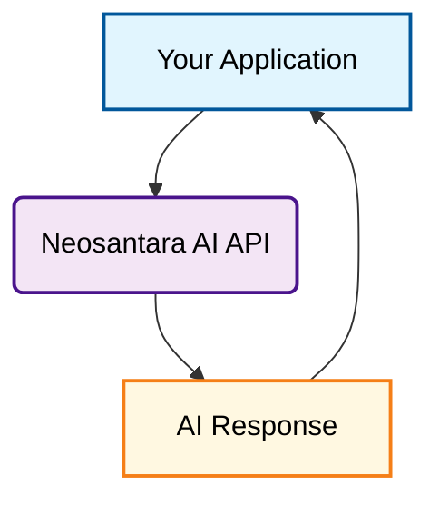

<Note>
  Looking for a step-by-step tutorial to get started in under 5 minutes? Head to our [Quickstart guide](/api-reference/quickstart#invoke-the-chat-api-calls) and start coding!
</Note>

## Who are we?

**Neosantara AI (NAI) is independently developed and maintained by a dedicated individual** with a passion for making advanced AI technology accessible to developers and organizations. Our mission is to empower individuals and organizations with accurate, unbiased, and factual information through cutting-edge Artificial Intelligence technology.

## What is the Neosantara API?

Building AI applications that leverage real-time online information or advanced multimodal capabilities can be complex. Neosantara AI serves as a unified gateway platform that provides standardized API access to various state-of-the-art language models (LLMs) and multimodal AI models from multiple providers.

Instead of managing multiple API integrations, authentication systems, and billing platforms from different AI providers, Neosantara AI consolidates everything into a single, consistent API interface. This allows you to focus on building your core application while we handle the complexity of model integration, optimization, and reliability.

<Note>
   **Neosantara AI is an independent product and is not affiliated with, endorsed by, or officially connected to these model providers**. We serve as an API gateway to help you interact with their technology through a unified interface.
</Note>

<Info>
  If you're an AI developer looking to integrate your application with our API, or seek increased API limits, [please reach out!](mailto:support@neosantara.xyz)
</Info>

## Why choose Neosantara?

Neosantara AI simplifies AI integration with features designed for developers and production environments.

<AccordionGroup>

  <Accordion title="Unified API Interface">
    Access multiple AI models from different providers through a single, OpenAI-compatible API. Switch between models without changing your codebase. Integrate seamlessly using our REST API or through the [OpenAI SDK](/api-reference/quickstart).
  </Accordion>

  <Accordion title="Transparent & Informative">
    Our detailed documentation ensures you're never left in the dark. From setup basics to nuanced features, we've got you covered.
  </Accordion>

</AccordionGroup>

## How does the Neosantara AI API work?

The Neosantara AI API acts as a gateway between your application and various AI model providers.

Here's a simplified diagram illustrating the core flow of the Neosantara AI API:

## Getting started

[Sign up](https://app.neosantara.xyz/signup) for Neosantara AI to get your API Key. You receive **10,000 free API Tokens every month**. No credit card required.

<Card icon="key" href="https://app.neosantara.xyz/api-keys" title="Get your free API key" horizontal>
  10,000 free API Tokens every month. No credit card required.
</Card>

To get started with Neosantara APIs, head to our [Quickstart Guide](/api-reference/quickstart) and follow the steps.

## Support

Got questions? Encountered an issue? Need help with integration? Our support team is here to assist.

- **Email**: [halo@neosantara.xyz](mailto:halo@neosantara.xyz)
- **Technical Support**: [support@neosantara.xyz](mailto:support@neosantara.xyz)
- **Documentation**: Browse our comprehensive guides and API reference

We're committed to helping you build successfully with Neosantara AI.