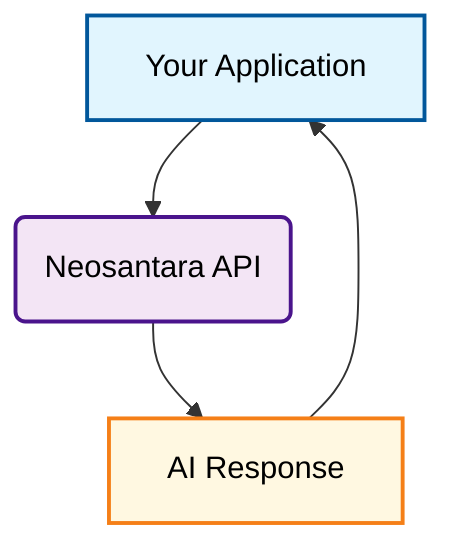

<Note>
  Looking for a step-by-step tutorial to get started in under 5 minutes? Head to our [Quickstart guide](/en/quickstart#make-your-first-request) and start coding!
</Note>

## Who are we?

**Neosantara (NAI) is independently developed and maintained by a dedicated individual.** Our goal is to provide accurate, unbiased information through AI technology.

## What is the Neosantara API?

Building AI applications that use real-time information or multimodal capabilities usually means integrating with several providers. Neosantara is a unified gateway that provides API access to language and multimodal AI models from multiple providers.

Instead of managing separate API keys, authentication systems, and billing platforms, Neosantara consolidates everything into one API. This lets you focus on your application while we handle model integration and reliability.

<Note>
   **Neosantara is an independent product and is not affiliated with, endorsed by, or officially connected to these model providers**. We serve as an API gateway to help you interact with their technology through a unified interface.
</Note>

<Info>
  If you're an AI developer looking to integrate your application with our API, or seek increased API limits, [please reach out!](mailto:support@neosantara.xyz)
</Info>

## Why choose Neosantara?

<AccordionGroup>

  <Accordion title="Unified API Interface">
    Access multiple AI models from different providers through a single, OpenAI-compatible API. Switch between models without changing your codebase. Integrate through the REST API or [OpenAI SDK](/en/quickstart).
  </Accordion>

  <Accordion title="Transparent & Informative">
    Our documentation covers setup basics to advanced features.
  </Accordion>

</AccordionGroup>

## How does the Neosantara API work?

The Neosantara API acts as a gateway between your application and various AI model providers.

Here's a simplified diagram illustrating the core flow of the Neosantara API:

```mermaid
graph TD
   A[Your Application] --> B(Neosantara API);
   B --> C[AI Response];
   C --> A;

   %% Styling
   classDef client fill:#e1f5fe,stroke:#01579b,stroke-width:2px,color:#000
   classDef api fill:#f3e5f5,stroke:#4a148c,stroke-width:2px,color:#000
   classDef response fill:#fff8e1,stroke:#f57f17,stroke-width:2px,color:#000

   class A client
   class B api
   class C response
```

## Getting started

[Sign up](https://app.neosantara.xyz/signup) for Neosantara to get your API Key. You receive **free initial credits** to get started. Check the [Dashboard](https://app.neosantara.xyz/dashboard) for current promotional details.

<Card icon="key" href="https://app.neosantara.xyz/api-keys" title="Get your free API key" horizontal>
  Free initial credits. No credit card required.
</Card>

To get started with Neosantara APIs, head to our [Quickstart Guide](/en/quickstart) and follow the steps.

## Support

Got questions? Encountered an issue? Need help with integration? Our support team is here to assist.

- **Email**: [support@neosantara.xyz](mailto:support@neosantara.xyz)
- **Technical Support**: [support@neosantara.xyz](mailto:support@neosantara.xyz)
- **Documentation**: Browse our comprehensive guides and API reference

