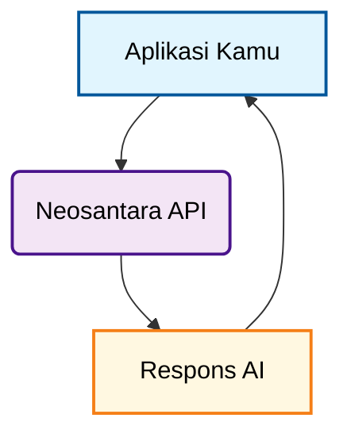

<Note>
  Mencari tutorial langkah demi langkah untuk memulai dalam waktu kurang dari 5 menit? Buka [Panduan Mulai Cepat](/id/quickstart) dan mulai coding!
</Note>

## Siapa Kami?

**Neosantara (NAI) dikembangkan dan dikelola secara independen oleh individu yang berdedikasi** dengan hasrat untuk membuat teknologi AI tingkat lanjut dapat diakses oleh pengembang dan organisasi. Misi kami adalah untuk memberdayakan individu dan organisasi dengan informasi yang akurat, tidak memihak, dan faktual melalui teknologi Kecerdasan Buatan yang mutakhir.

## Apa itu Neosantara API?

Membangun aplikasi AI yang memanfaatkan informasi online waktu nyata atau kemampuan multimodal tingkat lanjut bisa menjadi rumit. Neosantara berfungsi sebagai platform gateway terpadu yang menyediakan akses API terstandarisasi ke berbagai model bahasa besar (LLM) dan model AI multimodal tercanggih dari berbagai penyedia.

Alih-alih mengelola banyak integrasi API, sistem autentikasi, dan platform penagihan dari penyedia AI yang berbeda, Neosantara mengonsolidasikan semuanya ke dalam satu API yang konsisten. Ini memungkinkan Kamu untuk fokus membangun aplikasi inti Kamu sementara kami menangani kompleksitas integrasi, optimalisasi, dan keandalan model.

<Note>
   **Neosantara adalah produk independen dan tidak berafiliasi dengan, didukung oleh, atau secara resmi terhubung dengan penyedia model tersebut**. Kami berfungsi sebagai gateway API untuk membantu Kamu berinteraksi dengan teknologi mereka melalui antarmuka yang terpadu.
</Note>

<Info>
  Jika Kamu adalah pengembang AI yang ingin mengintegrasikan aplikasi Kamu dengan API kami, atau mencari peningkatan batas API, [silakan hubungi kami!](mailto:support@neosantara.xyz)
</Info>

## Mengapa memilih Neosantara?

Neosantara menyederhanakan integrasi AI dengan fitur yang dirancang untuk pengembang dan lingkungan produksi.

<AccordionGroup>

  <Accordion title="Antarmuka API Terpadu">
    Akses berbagai model AI dari penyedia yang berbeda melalui satu API yang kompatibel dengan OpenAI. Beralih antar model tanpa mengubah kode Kamu. Integrasikan secara mulus menggunakan REST API kami atau melalui [SDK OpenAI](/id/quickstart).
  </Accordion>

  <Accordion title="Transparan & Informatif">
    Dokumentasi terperinci kami memastikan Kamu tidak pernah dalam kegelapan. Dari dasar-dasar penyiapan hingga fitur-fitur bernuansa, kami siap membantu Kamu.
  </Accordion>

</AccordionGroup>

## Bagaimana cara kerja Neosantara API?

API Neosantara bertindak sebagai gateway antara aplikasi Kamu dan berbagai penyedia model AI.

Berikut adalah diagram sederhana yang mengilustrasikan alur inti API Neosantara:

## Memulai

[Daftar](https://app.neosantara.xyz/signup) di Neosantara untuk mendapatkan Kunci API Kamu. Kamu menerima **kredit awal gratis** untuk memulai. Periksa [Dashboard](https://app.neosantara.xyz/dashboard) untuk detail promosi saat ini.

<Card icon="key" href="https://app.neosantara.xyz/api-keys" title="Dapatkan kunci API gratis Kamu" horizontal>
  Kredit awal gratis. Tidak diperlukan kartu kredit.
</Card>

Untuk memulai dengan API Neosantara, buka [Panduan Mulai Cepat](/id/quickstart) kami dan ikuti langkah-langkahnya.

## Dukungan

Punya pertanyaan? Menghadapi masalah? Butuh bantuan dengan integrasi? Tim dukungan kami siap membantu.

- **Email**: [support@neosantara.xyz](mailto:support@neosantara.xyz)
- **Dukungan Teknis**: [support@neosantara.xyz](mailto:support@neosantara.xyz)
- **Dokumentasi**: Telusuri panduan komprehensif dan referensi API kami

Kami berkomitmen untuk membantu Kamu membangun dengan sukses bersama Neosantara.