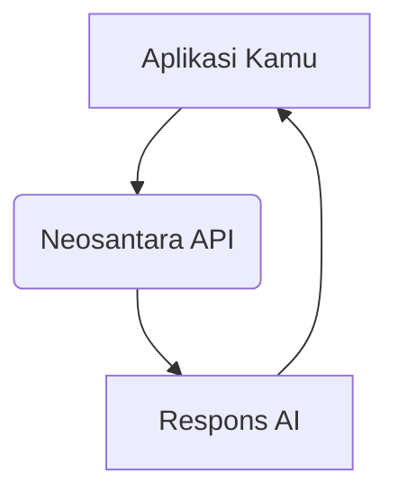

<Note>
  Ingin mulai dalam 5 menit? Lihat [Panduan Mulai Cepat](/id/quickstart) dan mulai coding.
</Note>

## Siapa Kami?

**Neosantara (NAI) dikembangkan secara independen** untuk mempermudah akses teknologi AI bagi pengembang. Misi kami adalah menyediakan akses informasi yang akurat dan objektif melalui teknologi AI mutakhir.

## Apa itu Neosantara API?

Neosantara adalah gerbang API terpadu untuk berbagai model bahasa (LLM) dan multimodal dari berbagai penyedia.

Kami menyederhanakan integrasi, autentikasi, dan penagihan ke dalam satu interface yang konsisten. Kamu bisa fokus membangun aplikasi, sementara kami menangani kompleksitas integrasi modelnya.

<Note>
   **Neosantara adalah produk independen** dan tidak berafiliasi resmi dengan penyedia model yang ada. Kami berfungsi sebagai API gateway.
</Note>

## Mengapa Neosantara?

<AccordionGroup>
  <Accordion title="Satu API untuk Semua">
    Akses berbagai model melalui satu API yang kompatibel dengan OpenAI. Ganti model tanpa mengubah kode.
  </Accordion>

  <Accordion title="Transparan">
    Dokumentasi lengkap untuk membantu Kamu dari tahap setup hingga fitur lanjutan.
  </Accordion>
</AccordionGroup>

## Cara Kerja

Neosantara API bertindak sebagai perantara antara aplikasi Kamu dan penyedia model AI.

## Memulai

[Daftar](https://app.neosantara.xyz/signup) untuk mendapatkan API Key. Pengguna baru mendapatkan **20.000 kredit gratis** dan **refill 10.000 kredit** setiap bulan.

<Card icon="key" href="https://app.neosantara.xyz/api-keys" title="Dapatkan API Key Gratis" horizontal>
  20rb kredit awal & 10rb refill bulanan. Tanpa kartu kredit.
</Card>

## Dukungan

- **Email**: [support@neosantara.xyz](mailto:support@neosantara.xyz)
- **Teknis**: [support@neosantara.xyz](mailto:support@neosantara.xyz)
