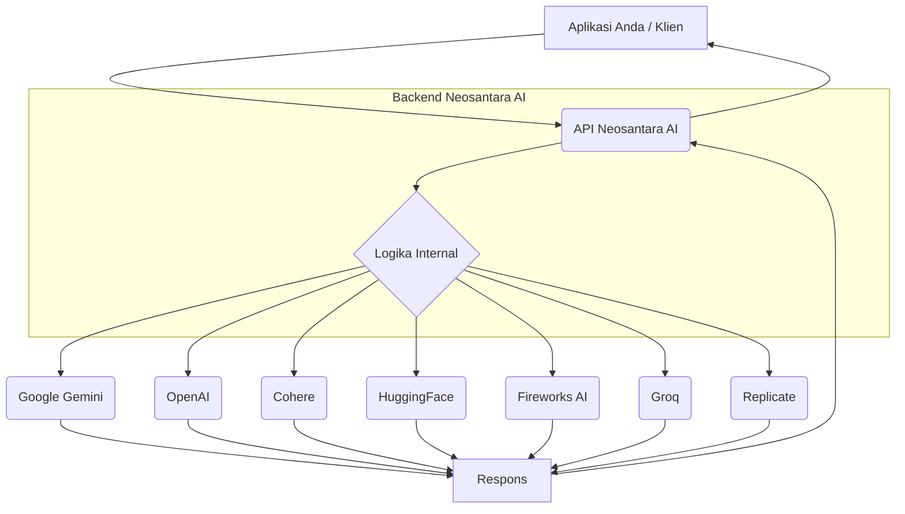

<Note>
  Ingin tutorial langkah demi langkah untuk memulai dalam waktu kurang dari 5 menit? Kunjungi [Panduan Cepat](/api-reference/quickstart) dan mulai coding!
</Note>

## Siapa kami?

Kami adalah tim peneliti dan pengembang AI yang bersemangat untuk membantu Anda membangun generasi berikutnya dari asisten AI. **Neosantara AI (atau disebut juga NAI) dikembangkan secara independen oleh individu yang berdedikasi**, dengan komitmen untuk menyediakan teknologi AI yang canggih dan mudah diakses.

Misi kami adalah memberdayakan individu dan organisasi dengan informasi yang akurat, tidak bias, dan faktual melalui teknologi Kecerdasan Buatan yang mutakhir.

## Apa itu API Neosantara?

Membangun agen AI yang memanfaatkan informasi online real-time atau kemampuan canggih lainnya bukanlah tugas yang sederhana. Neosantara AI berfungsi sebagai platform yang dioptimalkan untuk berbagai model AI generatif (LLM) dan multimodal, bertujuan untuk menyediakan akses API yang efisien, cepat, dan andal.

Neosantara AI mengambil beban integrasi, optimasi, dan pengelolaan berbagai model AI dari berbagai penyedia, memungkinkan Anda untuk fokus pada pengembangan aplikasi inti Anda. Semua dalam satu panggilan API!

<Note>
  Meskipun Neosantara AI menyediakan akses ke berbagai model AI dari penyedia berbeda (seperti Google Gemini, OpenAI, Cohere, dan lainnya), harap diperhatikan bahwa **Neosantara AI adalah produk independen dan tidak berafiliasi langsung dengan penyedia model tersebut**. Kami berfungsi sebagai gerbang untuk membantu Anda berinteraksi dengan teknologi mereka.
</Note>

<Info>
  Jika Anda pengembang AI yang ingin mengintegrasikan aplikasi Anda dengan API kami, atau mencari batas API yang lebih tinggi, [silakan hubungi kami!](mailto:support@neosantara.xyz)
</Info>

## Mengapa memilih Neosantara?

Neosantara AI unggul di mana yang lain mungkin kurang, dengan API AI yang dioptimalkan untuk LLM dan kebutuhan pengembangan Anda.

<AccordionGroup>

  <Accordion title="Ramah Integrasi">
    Kami menghargai esensi adaptabilitas. Itulah mengapa mengintegrasikan API kami dengan pengaturan Anda yang ada sangat mudah. Anda dapat menggunakan panggilan API sederhana kami dan juga menggunakan API Neosantara melalui [OpenAI SDK](/api-reference/quickstart).
  </Accordion>

  <Accordion title="Transparan & Informatif">
    Dokumentasi terperinci kami memastikan Anda tidak pernah kebingungan. Dari dasar pengaturan hingga fitur yang lebih kompleks, kami siap membantu Anda.
  </Accordion>
</AccordionGroup>

## Bagaimana cara kerja API Neosantara AI?

API Neosantara AI menangani kompleksitas interaksi dengan berbagai model AI canggih. Alih-alih mengelola beberapa API dari penyedia berbeda, Neosantara AI bertindak sebagai gerbang tunggal. Ini mengurus semua overhead dalam memilih model terbaik, memformat permintaan, dan mengoptimalkan respons, semua dalam satu panggilan API.

Neosantara AI dapat menggabungkan kemampuan dari berbagai model untuk memberikan respons yang paling relevan dengan tugas, kueri, atau tujuan Anda. Selain itu, Neosantara AI memungkinkan pengembang untuk menambahkan parameter khusus seperti konteks dan membatasi token respons untuk pengalaman AI yang optimal.

Neosantara AI juga dapat membantu agen AI Anda membuat keputusan yang lebih baik dengan menyediakan informasi terstruktur atau ringkasan untuk komunikasi antar-agen.

Berikut adalah diagram sederhana yang menggambarkan alur inti API Neosantara AI:

## Memulai

[Daftar](https://app.neosantara.xyz/signup) untuk Neosantara AI untuk mendapatkan Kunci API Anda. Anda menerima **7,500 Token API gratis setiap bulan**. Tidak perlu kartu kredit.

<Card icon="key" href="https://app.neosantara.xyz/api-keys" title="Dapatkan kunci API gratis Anda" horizontal>
  7,500 Token API gratis setiap bulan. **Tidak perlu kartu kredit.**
</Card>

Untuk memulai dengan API Neosantara, kunjungi [Panduan Cepat](/api-reference/quickstart) dan ikuti langkah-langkahnya.

<Note>
  Punya pertanyaan? Menemui masalah? Hanya penasaran? Jangan ragu! Tim dukungan kami selalu siap membantu. Bergabunglah dengan kami, jelajahi lebih dalam, dan ubah pengalaman Anda! [Hubungi kami!](mailto:halo@neosantara.xyz)
</Note>