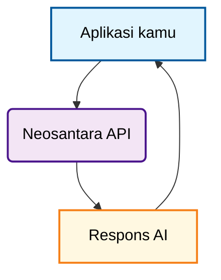

<Note>
  Mencari tutorial langkah demi langkah untuk memulai dalam waktu kurang dari 5 menit? Buka [Panduan Mulai Cepat](/id/quickstart) dan mulai coding!
</Note>

## Siapa Kami?

**Neosantara (NAI)** adalah platform AI independen yang dikembangkan untuk menyediakan teknologi AI tingkat lanjut bagi pengembang dan organisasi.

## Apa itu Neosantara API?

Membangun aplikasi AI yang memanfaatkan data daring waktu nyata atau kemampuan multimodal tingkat lanjut bisa menjadi rumit. Neosantara hadir sebagai platform gateway terpadu yang menyediakan akses API standar ke berbagai model bahasa besar (LLM) dan model AI multimodal dari berbagai penyedia.

Alih-alih mengelola banyak integrasi API, sistem autentikasi, dan platform penagihan dari penyedia AI berbeda, Neosantara menggabungkan semuanya ke dalam satu API yang konsisten. Kamu dapat fokus membangun aplikasi inti sementara kami menangani kompleksitas integrasi, optimasi, dan keandalan model.

<Note>
   **Neosantara adalah produk independen dan tidak berafiliasi dengan, didukung oleh, atau secara resmi terhubung dengan penyedia model tersebut**. Kami berfungsi sebagai gateway API untuk membantu Kamu berinteraksi dengan teknologi mereka melalui antarmuka yang terpadu.
</Note>

<Info>
  Jika Kamu adalah pengembang AI yang ingin mengintegrasikan aplikasi Kamu dengan API kami, atau mencari peningkatan batas API, [silakan hubungi kami!](mailto:support@neosantara.xyz)
</Info>

## Mengapa memilih Neosantara?

Neosantara menyederhanakan integrasi AI dengan fitur yang dirancang untuk pengembang dan lingkungan produksi.

<AccordionGroup>

  <Accordion title="Antarmuka API Terpadu">
    Akses berbagai model AI dari penyedia berbeda melalui satu API yang kompatibel dengan OpenAI. Ganti model tanpa mengubah kode. Integrasi berjalan lancar melalui REST API atau [SDK OpenAI](/id/quickstart).
  </Accordion>

  <Accordion title="Transparan & Informatif">
    Dokumentasi terperinci kami membantu Kamu memahami setiap fitur. Mulai dari dasar hingga fitur lanjutan.
  </Accordion>

</AccordionGroup>

## Bagaimana cara kerja Neosantara API?

API Neosantara bertindak sebagai gateway antara aplikasi Kamu dan berbagai penyedia model AI.

Berikut adalah diagram sederhana yang mengilustrasikan alur inti API Neosantara:

```mermaid
graph TD
   A[Aplikasi kamu] --> B(Neosantara API);
   B --> C[Respons AI];
   C --> A;

   %% Styling
   classDef client fill:#e1f5fe,stroke:#01579b,stroke-width:2px,color:#000
   classDef api fill:#f3e5f5,stroke:#4a148c,stroke-width:2px,color:#000
   classDef response fill:#fff8e1,stroke:#f57f17,stroke-width:2px,color:#000

   class A client
   class B api
   class C response
```

## Memulai

[Daftar](https://app.neosantara.xyz/signup) di Neosantara untuk mendapatkan Kunci API. Kamu akan menerima **kredit awal gratis** untuk memulai. Periksa [Dashboard](https://app.neosantara.xyz/dashboard) untuk detail promo terkini.

<Card icon="key" href="https://app.neosantara.xyz/api-keys" title="Dapatkan kunci API gratis Kamu" horizontal>
  Kredit awal gratis. Tidak diperlukan kartu kredit.
</Card>

Untuk memulai dengan API Neosantara, buka [Panduan Mulai Cepat](/id/quickstart) kami dan ikuti langkah-langkahnya.

## Dukungan

Punya pertanyaan atau butuh bantuan dengan integrasi? Hubungi kami:

- **Email**: [support@neosantara.xyz](mailto:support@neosantara.xyz)
- **Dokumentasi**: Jelajahi panduan lengkap dan referensi API kami