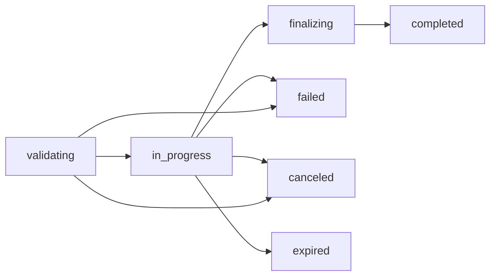

## Pendahuluan

API Batch memungkinkan Kamu memproses permintaan API dalam jumlah besar secara asinkron dengan biaya setengah dari panggilan API standar. Sangat cocok untuk operasi massal, pipa pemrosesan data, dan tugas semalam yang tidak memerlukan respons segera.

<Card icon="sparkles" title="Hemat 50% dengan Pemrosesan Batch" color="#16a34a">
API Batch menawarkan **penghematan biaya 50%** dibandingkan dengan panggilan API sinkron standar. Proses ribuan permintaan secara efisien saat Kamu tidur!
</Card>

### Manfaat Utama

- 💰 **Pengurangan Biaya 50%**: Biaya yang jauh lebih rendah untuk pemrosesan massal.
- ⚡ **Pemrosesan Asinkron**: Kirim tugas dan ambil hasilnya saat sudah siap.
- 📊 **Pelacakan Kemajuan**: Pantau status penyelesaian secara real-time.
- 🔄 **Upaya Ulang Otomatis**: Logika upaya ulang bawaan untuk permintaan yang gagal.
- 📁 **Hasil Terorganisir**: File output terpisah untuk keberhasilan dan kesalahan.
- ⏱️ **Jendela 24 Jam**: Semua batch selesai dalam waktu 24 jam.

### Cara Kerja

1. **Unggah** file JSONL yang berisi permintaan Kamu.
2. **Buat** tugas batch yang merujuk ke file yang diunggah.
3. **Pantau** kemajuan saat permintaan diproses secara asinkron.
4. **Unduh** hasil dari file output setelah selesai.

## Endpoint API

<CardGroup cols={2}>
  <Card
    title="Buat Batch"
    icon="play"
    href="/api-reference/batches/create"
    color="#10b981"
  >
    Mulai tugas batch baru untuk pemrosesan permintaan asinkron
  </Card>
  <Card
    title="Ambil Batch"
    icon="chart-line"
    href="/api-reference/batches/get"
    color="#3b82f6"
  >
    Periksa status dan kemajuan tugas batch
  </Card>
  <Card
    title="Batalkan Batch"
    icon="stop"
    href="/api-reference/batches/cancel"
    color="#ef4444"
  >
    Batalkan tugas batch yang sedang berjalan sebelum selesai
  </Card>
  <Card
    title="Daftar Batch"
    icon="list"
    href="/api-reference/batches/list"
    color="#f59e0b"
  >
    Lihat semua tugas batch Kamu dengan pemfilteran dan paginasi
  </Card>
</CardGroup>

## Endpoint yang Didukung

Pemrosesan batch tersedia untuk endpoint berikut:

<CardGroup cols={3}>
  <Card title="Chat Completions" icon="comments">
    `/v1/chat/completions`

    Proses percakapan dalam skala besar
  </Card>
  <Card title="Embeddings" icon="vector-square">
    `/v1/embeddings`

    Hasilkan embedding dalam jumlah banyak
  </Card>
  <Card title="Responses" icon="message-bot">
    `/v1/responses`

    Pembuatan respons batch
  </Card>
</CardGroup>

## Mulai Cepat

### Langkah 1: Siapkan File Input Kamu

Buat file JSONL dengan permintaan Kamu:

```json
{"custom_id": "request-1", "method": "POST", "url": "/v1/chat/completions", "body": {"model": "garda-beta-mini", "messages": [{"role": "user", "content": "Terjemahkan ke bahasa Indonesia: Hello"}], "max_tokens": 100}}
{"custom_id": "request-2", "method": "POST", "url": "/v1/chat/completions", "body": {"model": "garda-beta-mini", "messages": [{"role": "user", "content": "Terjemahkan ke bahasa Indonesia: Goodbye"}], "max_tokens": 100}}
{"custom_id": "request-3", "method": "POST", "url": "/v1/chat/completions", "body": {"model": "garda-beta-mini", "messages": [{"role": "user", "content": "Terjemahkan ke bahasa Indonesia: Thank you"}], "max_tokens": 100}}
```

### Langkah 2: Unggah File

```bash
curl https://api.neosantara.xyz/v1/files \
  -H "Authorization: Bearer KUNCI_API_ANDA" \
  -F purpose="batch" \
  -F file="@batch_input.jsonl"
```

Respons:

```json
{
  "id": "file-abc123",
  "purpose": "batch",
  "filename": "batch_input.jsonl",
  "bytes": 1024,
  "created_at": 1699564800
}
```

### Langkah 3: Buat Batch

```bash
curl https://api.neosantara.xyz/v1/batches \
  -H "Authorization: Bearer KUNCI_API_ANDA" \
  -H "Content-Type: application/json" \
  -d '{ 
    "input_file_id": "file-abc123",
    "endpoint": "/v1/chat/completions",
    "completion_window": "24h"
  }'
```

Respons:

```json
{
  "id": "batch-xyz789",
  "status": "validating",
  "request_counts": {
    "total": 3,
    "completed": 0,
    "failed": 0
  }
}
```

### Langkah 4: Pantau Kemajuan

```bash
curl https://api.neosantara.xyz/v1/batches/batch-xyz789 \
  -H "Authorization: Bearer KUNCI_API_ANDA"
```

### Langkah 5: Unduh Hasil

Setelah status batch menjadi `completed`:

```bash
# Unduh hasil yang berhasil
curl https://api.neosantara.xyz/v1/files/file-output-123/content \
  -H "Authorization: Bearer KUNCI_API_ANDA" \
  --output results.jsonl

# Unduh kesalahan (jika ada)
curl https://api.neosantara.xyz/v1/files/file-errors-456/content \
  -H "Authorization: Bearer KUNCI_API_ANDA" \
  --output errors.jsonl
```

## Siklus Hidup Status Batch



| Status | Deskripsi |
| -------- | ------------- |
| `validating` | File input sedang divalidasi |
| `in_progress` | Permintaan sedang diproses |
| `finalizing` | Hasil sedang disusun |
| `completed` | Batch selesai dengan sukses |
| `failed` | Batch mengalami kesalahan |
| `canceled` | Batch dibatalkan secara manual |
| `expired` | Batch melebihi jendela 24 jam |

## Batasan Tingkat Layanan

<Warning>
**Tingkat Free**: API Batch tidak tersedia pada tingkat layanan Free. [Tingkatkan ke Basic atau lebih tinggi](https://app.neosantara.xyz/billing) untuk membuka pemrosesan batch.
</Warning>

| Tingkat | Batch Bersamaan | Status |
| ------ | ------------------- | ---------
| Free | 0 | ❌ Tidak Tersedia |
| Basic | 5 | ✅ Tersedia |
| Pro | 10 | ✅ Tersedia |
| Enterprise | Kustom | ✅ Tersedia |

## Praktik Terbaik

<AccordionGroup>
  <Accordion title="Optimalkan Ukuran Batch" icon="gauge-high">
    Seimbangkan antara ukuran batch dan waktu penyelesaian. Batch yang lebih besar (1000+ permintaan) memaksimalkan penghematan biaya, sementara batch yang lebih kecil selesai lebih cepat. Pertimbangkan persyaratan kasus penggunaan Kamu.
  </Accordion>
  
  <Accordion title="Gunakan ID Kustom Secara Efektif" icon="hashtag">
    Tetapkan nilai `custom_id` yang bermakna untuk setiap permintaan. Ini membantu Kamu memetakan kembali hasil ke data asli Kamu saat memproses file output.
  </Accordion>
  
  <Accordion title="Tangani Kegagalan Parsial" icon="triangle-exclamation">
    Selalu periksa file output dan file kesalahan. Beberapa permintaan mungkin berhasil sementara yang lain gagal. Terapkan logika upaya ulang untuk permintaan yang gagal jika diperlukan.
  </Accordion>
  
  <Accordion title="Pantau Batas Bersamaan" icon="chart-line">
    Tetap berada dalam batas batch bersamaan tingkat layanan Kamu. Antrekan batch tambahan untuk dimulai setelah batch saat ini selesai.
  </Accordion>
  
  <Accordion title="Atur Batas Waktu yang Sesuai" icon="clock">
    Semua batch selesai dalam waktu 24 jam. Untuk operasi yang sensitif terhadap waktu, pertimbangkan untuk menggunakan panggilan API standar saja.
  </Accordion>
  
  <Accordion title="Validasi Format Input" icon="check">
    Pastikan file JSONL Kamu diformat dengan benar sebelum membuat batch. Format yang tidak valid akan menyebabkan kegagalan segera selama validasi.
  </Accordion>
</AccordionGroup>

## Contoh Kasus Penggunaan

<CardGroup cols={2}>
  <Card title="Pelabelan Data" icon="tags">
    Klasifikasi atau labeli ribuan sampel teks untuk dataset pelatihan ML.
  </Card>
  
  <Card title="Moderasi Konten" icon="shield-check">
    Analisis volume besar konten buatan pengguna untuk kepatuhan kebijakan.
  </Card>
  
  <Card title="Terjemahan" icon="language">
    Terjemahkan dokumentasi atau konten ke dalam berbagai bahasa dalam skala besar.
  </Card>
  
  <Card title="Analisis Sentimen" icon="face-smile">
    Proses umpan balik pelanggan, ulasan, atau postingan media sosial secara massal.
  </Card>
  
  <Card title="Pembuatan Embeddings" icon="brain">
    Buat penyematan vektor untuk seluruh koleksi dokumen atau basis pengetahuan.
  </Card>
  
  <Card title="Pembuatan Laporan" icon="file-invoice">
    Hasilkan ratusan laporan yang dipersonalisasi dari data terstruktur.
  </Card>
</CardGroup>

## Penanganan Kesalahan

Kesalahan batch umum dan solusinya:

| Kode Kesalahan | Deskripsi | Solusi |
| ------------ | ------------- | ---------- |
| `batch_api_not_allowed` | Pembatasan tingkat Free | Tingkatkan ke tingkat Basic atau lebih tinggi |
| `missing_required_field` | Parameter wajib hilang | Sertakan semua bidang yang diperlukan dalam permintaan |
| `invalid_endpoint` | Endpoint tidak didukung | Gunakan endpoint yang didukung saja |
| `invalid_input_file` | File tidak ditemukan atau tujuan salah | Pastikan file ada dan memiliki `purpose="batch"` |
| `invalid_jsonl` | Validasi JSONL gagal | Periksa format file untuk kesalahan sintaksis |
| `concurrent_batches_limit` | Terlalu banyak batch aktif | Tunggu hingga batch yang ada selesai |
| `batch_not_found` | ID Batch tidak ditemukan | Verifikasi bahwa batch_id sudah benar |
| `cannot_cancel` | Batch sudah selesai | Hanya dapat membatalkan batch yang sedang berjalan |

## Batas Penggunaan

Pemrosesan batch memiliki batas penggunaan yang berbeda dari panggilan API standar:

- **Tugas Bersamaan**: Berdasarkan tingkat layanan Kamu (lihat tabel di atas).
- **Permintaan per Batch**: Tidak ada batas keras, tetapi disarankan maksimal 10.000 untuk performa optimal.
- **Ukuran File**: Maksimum 100MB per file input.
- **Waktu Pemrosesan**: Semua batch selesai dalam waktu 24 jam.

<Tip>
Untuk memproses lebih dari 50.000 permintaan atau batas tugas bersamaan kustom, [hubungi tim enterprise kami](https://neosantara.xyz/contact) untuk rencana khusus.
</Tip>
